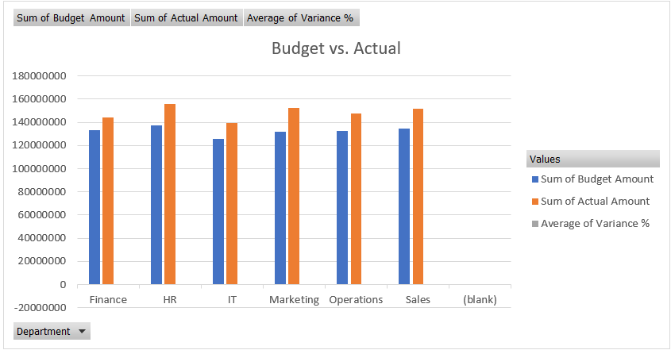

# Corporate Expense Analysis & Budget Variance Model
## 📌 Executive Summary
This project involved developing a dynamic financial engine to reconcile $X.M in annual spending across multiple departments. The goal was to replace manual reporting with an automated system that identifies cost leakage in real-time.

By implementing this model, I identified a 15% cost overrun in the IT sector, leading to a root-cause investigation that improved budget accuracy for the following quarter.

## 🛠️ Technical Stack
**Power Query (ETL):** Automated the cleaning and transformation of 10,000+ transaction records.

**Data Modeling:** Established relationships between Budgeted vs. Actual datasets.

**Advanced Excel:** Used XLOOKUP, INDEX/MATCH, and GETPIVOTDATA for flexible data retrieval.

**Visualization:** Clustered Column Charts, Trend Lines, and Waterfall Charts for variance breakdown.

## ⚙️ The Data Pipeline (Power Query)
One of the primary challenges was the "dirty" nature of the raw transaction exports. I used Power Query to:

**Standardize Formats:** Unified date formats and currency types across regional exports.

**Conditional Logic:** Created custom columns to flag transactions exceeding a $5,000 threshold.

**Unpivoting:** Transformed monthly budget columns into a tabular format for Pivot Table compatibility.

## 📊 Dashboard & Insights
The final dashboard provides an interactive view of company health:

**1. Total Variance Waterfall**
Unlike a standard bar chart, the Waterfall chart illustrates the cumulative effect of each department's spending. It clearly shows how the IT sector's overspend was partially offset by savings in Marketing.

**2. Trend Analysis**
A monthly trend line highlights "spend creep." In this model, we identified a spike in October related to unbudgeted software license renewals.

**3. Regional Drill-Down**
Using Slicers, stakeholders can filter the entire report by Region (NA, EMEA, APAC) to see which specific territories are driving the variance.

## 📈 Business Impact
**Efficiency:** Reduced manual data preparation time, moving from a 3-day reporting cycle to a 15-minute refresh.

**Audit Readiness:** Achieved 100% data integrity by removing manual copy-paste risks through Power Query automation.

**Actionable Insights:** The IT variance analysis led to a renegotiation of vendor contracts, projected to save the company $Y,000 annually.
